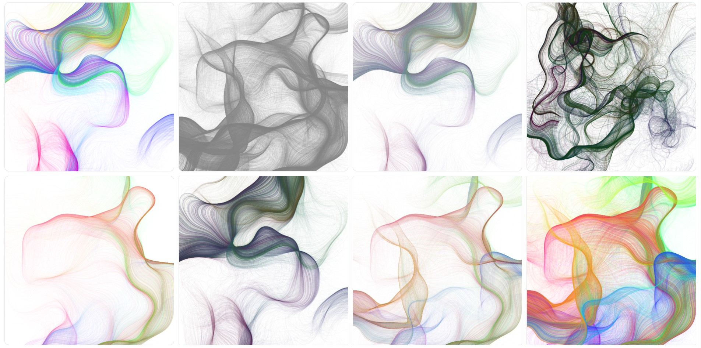

# Colorfield

Simplex noise abstraction animation.

- [Screenshots](#screenshots)
- [Getting started](#getting-started)
  - [Installation](#installation)
  - [Executing program](#executing-program)
  - [Configuration](#configuration)
- [License](#license)

## Screenshots




## Getting started

### Installation

```bash
git clone https://github.com/iibe/colorfield.git
```

### Executing program

```html
<!doctype html>
<html lang="en">
  <head>
    <meta charset="UTF-8" />
    <meta http-equiv="X-UA-Compatible" content="IE=edge" />
    <meta name="viewport" content="width=device-width, initial-scale=1.0" />
    <script defer src="./scripts/index.js"></script>
    <title>Colorfield</title>
  </head>
  <body>
    <canvas id="canvas"></canvas>
  </body>
</html>
```

```css
*,
*::before,
*::after {
  box-sizing: border-box;
  margin: 0;
  padding: 0;
}

html,
body {
  width: 100%;
  height: 100%;
}
```

```js
import Colorfield from "./colorfield/dist/colorfield.min";

new Colorfield("#canvas", {
  /** Configuration */
});
```

### Configuration

```ts
interface Configuration {
  /** Color mode. */
  colorMode: "hsla" | "grayscale";

  /** Color saturation. Value from 0 to 1. */
  colorIntensityMix: number;

  /** Color lightness. Value from 0 to 1. */
  colorLightnessMix: number;

  /** Color alpha channel. Value from 0 to 1. */
  colorOpacityMix: number;

  /** Number of frames to render. The higher the number, the longer the animation will take. Determined by chance. */
  frameRange: [number, number];

  /** Number of particles. The smaller number, the lower the computational cost. Value from 500 to 1000. */
  particleNumber: number;

  /** Base number. The higher value, the greater the distance between lines (the wider stripes). Should be within [500; 1000] range. */
  base: number;

  /** Step number. Value from 5 to 10. */
  step: number;

  /** Z-axis offset step. The higher higher, the faster curves direction will changes. Should be within [0.0005; 0.01] range. */
  zOffsetStep: number;
}
```

## License

This project is licensed under the MIT License - see the [LICENSE](/LICENSE) file for details.
